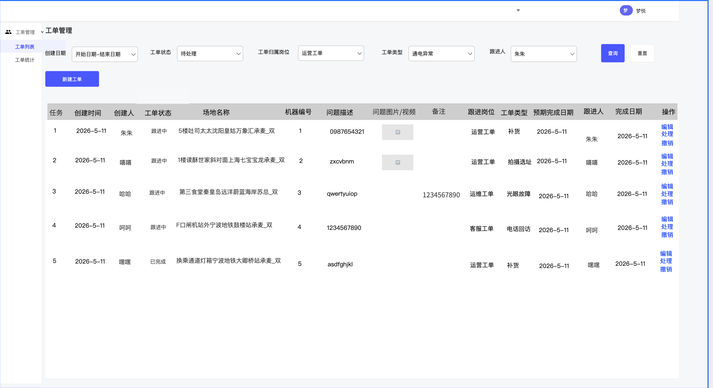
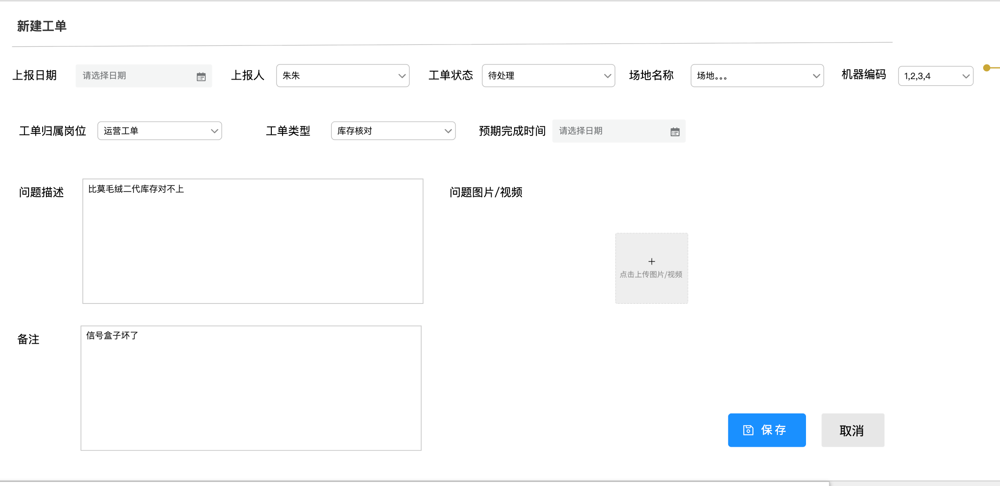
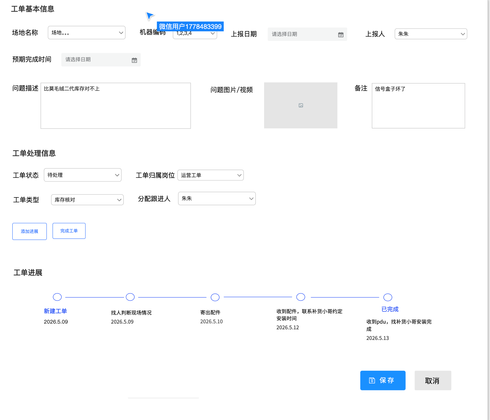
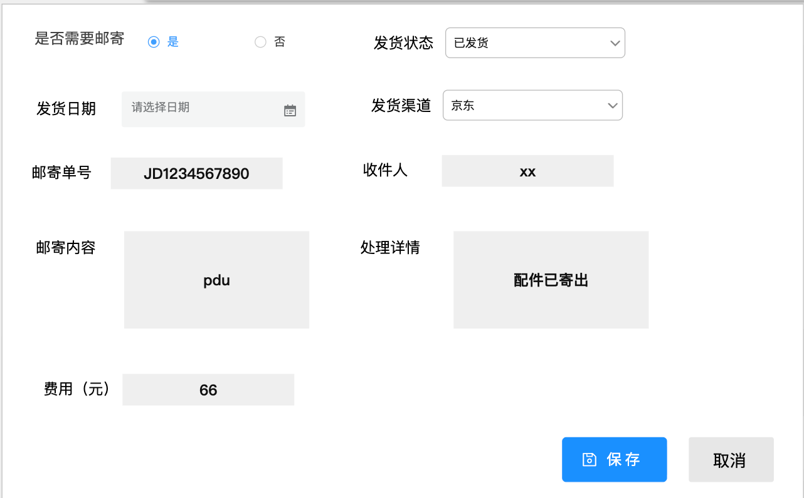
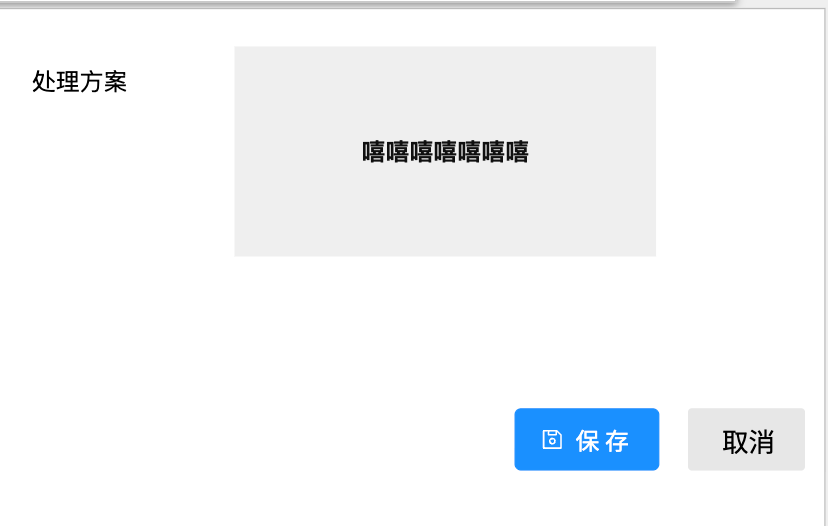

# 工单系统需求文档

**版本：** v1.0  
**日期：** 2026-05-12  
**状态：** 待评审

---

## 1. 项目概述

### 1.1 背景

本系统为内部工单管理平台，支持多岗位协作处理工单，涵盖运维、运营、售后、客服等场景。

### 1.2 目标

- 提供清晰的工单创建、分派、跟进、完成全流程管理；
- 提供数据统计能力，支持按类型和处理时效汇总工单数据；
- 系统入口简洁，支持简单登录鉴权。

---

## 2. 用户角色与权限

### 2.1 角色定义
 
| 角色 | 说明 |
|------|------|
| 普通用户 | 已登录的员工，具备特定归属岗位 |
| 管理员 | 具备所有操作权限，不受归属岗位限制 |
 
> 每个账号在系统中绑定一个或多个"工单归属岗位"（运营 / 运维 / 维修 / 客服）。

 ### 2.2 操作权限总览
 
| 操作 | 普通用户 | 管理员 |
|------|---------|--------|
| 查看工单列表 | 可查看所有工单 | 可查看所有工单 |
| 新建工单 | ✅ | ✅ |
| 编辑工单 | ✅所有工单 | ✅ 所有工单 |
| 处理工单 | ✅（无限制） | ✅ |
| 撤销工单 | 仅限本人上报的工单，且状态为待处理或跟进中 | ✅ 所有工单（状态为待处理或跟进中） |
| 查看处理记录 | ✅ | ✅ |

---

## 3. 前端页面功能

### 3.1 工单列表页

#### 3.1.1 页面概述

工单列表页为系统主页，以表格形式展示工单数据，支持筛选、排序和快捷操作。

#### 3.1.2 筛选与查询

列表顶部提供以下筛选条件，条件之间取"与"关系（同时满足），均为可选项：
 
| 筛选项 | 控件类型 | 说明 |
|--------|---------|------|
| 上报日期 | 日期范围选择器 | 可选起始日期和结束日期，筛选工单上报日期在该范围内的记录 |
| 工单状态 | 下拉多选 | 选项：待处理、跟进中、已完成、已撤销；默认全选（即不过滤） |
| 工单归属岗位 | 下拉多选 | 选项：运营、运维、维修、客服；**打开列表时，默认勾选当前登录账号所属岗位**；用户可手动修改选中项 |
| 工单类型 | 下拉多选 | 选项根据已选的"工单归属岗位"联动展示对应类型；若未选归属岗位，则展示所有类型 |
| 跟进人 | 下拉多选 | 选项为系统中所有用户，支持搜索 |
 
> **工单归属岗位默认逻辑说明：** 登录用户属于"运营"岗位，则进入列表时"工单归属岗位"默认勾选"运营"；管理员默认全选。用户调整筛选后，刷新页面恢复默认，不持久化筛选状态。
 

#### 3.1.3 排序

| 排序维度 | 规则 |
|---------|------|
| 默认排序 | 先按"上报日期"倒序（最新在前），同日期内再按"工单状态"排序：待处理 → 跟进中 → 已完成 → 已撤销 |
 
> 暂不支持用户自定义排序列。如后续有需要，可作为迭代项。
 

#### 3.1.4 列表字段展示

表格按列展示以下字段，所有字段均为只读展示：

| 列名 | 说明 |
|------|------|
| 上报日期 | 工单上报日期，精确到天 |
| 上报人 | 工单创建者的姓名 |
| 工单状态 | 待处理 / 跟进中 / 已完成 / 已撤销 |
| 关联场地 | 工单关联的场地名称，可能多个，逗号分隔展示 |
| 机器编号 | 关联的机器编号，可能多个，逗号分隔展示 |
| 问题描述 | 超长时截断展示，鼠标悬浮显示完整内容（PC端） |
| 问题图片/视频 | 以缩略图或图标形式展示，点击可预览 |
| 备注 | 超长截断，悬浮/点击展开 |
| 工单归属 | 运营 / 运维 / 维修 / 客服 |
| 工单类型 | 该归属下的具体类型名称 |
| 预期完成时间 | 日期+时间，精确到分钟；未填则显示"—" |
| 跟进人 | 当前分配的跟进人姓名；未分配则显示"未分配" |
| 处理记录 | 展示**最近一次**跟进记录，格式为：`操作时间，操作人，处理内容`（超长截断） |
| 实际完成时间 | 工单状态变更为"已完成"时系统记录的时间；未完成则显示"—" |
| 工单处理时效 | 见下方时效计算规则 |

**工单处理时效计算规则：**

| 工单状态 | 计算方式 |
|---------|---------|
| 待处理 / 跟进中 | `当前日期 - 上报日期`，单位：天，向下取整，仅作参考 |
| 已完成 | `实际完成日期 - 上报日期`，单位：天，向下取整 |
| 已撤销 | 显示"—"，不计算时效 |

> 时效计算以"天"为单位，取日期差的整数部分（如上报日期为 5月1日，当前/完成日期为 5月3日，则时效为 2 天）。

#### 3.1.5 操作项

每行工单末尾提供以下操作按钮：

| 操作 | 展示条件 | 权限 |
|------|---------|------|
| **编辑工单** | 始终展示，无权限时置灰 | 工单上报人或管理员 |
| **处理工单** | 始终展示 | 所有已登录用户 |
| **撤销工单** | 工单状态为"待处理"或"跟进中"时展示；已完成/已撤销不展示 | 工单上报人或管理员 |

> 对于无权限的操作（如非上报人点击编辑），点击后提示"无操作权限"，不进入编辑页面。

#### 3.1.6 顶部操作

| 操作 | 说明 |
|------|------|
| **新建工单** | 按钮位于列表右上方，点击进入新建工单页面，所有已登录用户可操作 |

---

### 3.2 新建工单 / 编辑工单

#### 3.2.1 页面说明

- **新建工单**：进入空白表单，所有字段均为初始值；
- **编辑工单**：进入已有数据的表单，允许修改的字段回填现有值；
- 两个页面共用同一套表单 UI，仅字段的可编辑状态略有差异（见下文）。


#### 3.2.2 表单字段

| 字段 | 控件类型 | 是否必填 | 新建时默认值 | 编辑时是否可改 | 说明 |
|------|---------|---------|------------|--------------|------|
| 上报日期 | 日期选择器（不可操作，只读展示） | — | 当天日期 | ❌ 不可修改 | 保存后锁定，不可再编辑 |
| 上报人 | 下拉选项（不可操作，只读展示） | — | 当前登录用户 | ❌ 不可修改 | 保存后锁定，不可再编辑 |
| 工单状态 | 下拉选项（不可操作，只读展示） | — | 待处理 | ❌ 不可在此页修改 | 状态仅可在"处理工单"页流转 |
| 关联场地 | 下拉多选 + 关键字模糊搜索 | 否 | 空 | ✅ | 输入关键字不分词模糊匹配场地名，可多选 |
| 机器编号 | 下拉多选 | 否 | 空 | ✅ | 选项与关联场地联动（仅展示所选场地下的机器）；若未选场地，则展示所有机器 |
| 问题描述 | 多行文本框 | ✅ 必填 | 空 | ✅ | 不限长度，建议 UI 限制在 2000 字以内 |
| 上传图片/视频 | 文件上传控件 | 否 | 空 | ✅ | 支持上传多张图片和视频；图片格式 JPG/PNG，单张 ≤ 5MB；视频格式 MP4，大小上限待定；已上传的文件可删除 |
| 备注 | 多行文本框 | 否 | 空 | ✅ | 补充说明，不限长度 |
| 工单归属 | 下拉单选 | ✅ 必填 | 空 | ✅ | 选项：运营、运维、维修、客服 |
| 工单类型 | 下拉单选 | ✅ 必填 | 空 | ✅ | 根据所选工单归属联动展示对应类型选项；切换归属后，已选类型清空 |
| 预期完成时间 | 日期 + 时间选择器 | 否 | 空 | ✅ | 精确到分钟；可清空 |


#### 3.2.3 操作

| 操作 | 说明 |
|------|------|
| **保存** | 校验必填项（问题描述、工单归属、工单类型），通过后保存并返回列表页 |
| **取消** | 放弃当前编辑内容，返回列表页；若有未保存改动，弹窗提示"确认放弃修改？" |

### 3.2.4 保存校验规则

| 校验项 | 规则 |
|--------|------|
| 问题描述 | 不能为空，不能只有空格 |
| 工单归属 | 必须选择 |
| 工单类型 | 必须选择（且须与工单归属匹配） |
| 其余字段 | 无强制校验 |

---

### 3.3 处理工单

#### 3.3.1 页面结构

处理工单页面分为三个区域：**工单基本信息**、**工单处理信息**、**工单处理详情**。

#### 3.3.2 工单基本信息（只读）

以下字段展示工单原始信息，在此页面**全部不可编辑**：

| 字段 | 说明 |
|------|------|
| 上报日期 | 工单上报日期 |
| 上报人 | 工单创建者 |
| 关联场地 | 工单关联场地（多个以逗号分隔） |
| 机器编号 | 关联机器编号（多个以逗号分隔） |
| 问题描述 | 工单问题描述全文 |
| 问题图片/视频 | 图片缩略图 + 视频链接，可点击预览 |
| 备注 | 工单备注 |
| 预期完成时间 | 预期完成日期 + 时间 |

#### 3.3.3 工单处理信息（可编辑）

| 字段 | 控件类型 | 是否必填 | 说明 |
|------|---------|---------|------|
| 工单状态 | 下拉单选 | ✅ 必填 | 流转规则：待处理 → 跟进中 → 已完成（不可逆，不可跳级）；不可手动选择"已撤销"（撤销需通过"撤销工单"操作）；“已完成”不可选择，点击"**完成工单**"按钮后变为“已完成”|
| 工单归属 | 下拉单选 | ✅ 必填 | 选项：运营、运维、维修、客服；可修改 |
| 工单类型 | 下拉单选 | 否 | 根据工单归属联动 |
| 分配跟进人 | 下拉单选 | 否 | 从系统用户中选择；选项支持搜索；可清空 |

#### 3.3.4 工单进展

此区域以时间线形式展示本工单的所有处理记录，**按时间由近到远（最新记录在最上方）**排列。

每条处理记录包含以下信息：

| 字段 | 说明 |
|------|------|
| 处理时间 | 该条记录保存时的操作时间（系统自动记录，不可修改） |
| 处理人 | 保存该条记录时的当前登录用户（系统自动记录，不可修改） |
| 处理内容 | 本次处理时填入的有效内容 |

> 处理记录保存后**不可修改，不可删除**，确保操作可追溯。

#### 3.3.5 添加处理记录


点击"**添加处理记录**"按钮，展开录入区域，字段如下：

| 字段 | 控件类型 | 是否必填 | 默认值 | 说明 |
|------|---------|---------|--------|------|
| 是否邮寄 | 单选（是 / 否） | 否 | 否 | 选择"是"后，下方展示邮寄相关字段；选择"否"则收起 |
| 快递单号 | 文本框 | 否 | 空 | 仅当"是否邮寄"为"是"时显示 |
| 快递渠道 | 下拉单选 | 否 | 空 | 仅当"是否邮寄"为"是"时显示；选项：顺丰 / 京东 / 跨越 / 德邦 / 其它渠道 |
| 寄出日期 | 日期选择器 | 否 | 当天日期 | 仅当"是否邮寄"为"是"时显示 |
| 收件人 | 文本框 | 否 | 当前登录用户姓名 | 仅当"是否邮寄"为"是"时显示；可手动修改 |
| 寄出内容 | 文本框 | 否 | 空 | 仅当"是否邮寄"为"是"时显示；描述邮寄物品 |
| 处理详情描述 | 多行文本框 | 是 | 空 | 记录本次处理的具体内容，无论是否邮寄均显示 |
| 费用 | 文本框（数字） | 否 | 空 | 本次处理产生的费用，单位：元；仅允许输入数字，保留两位小数 |

**保存处理记录时的系统行为：**

1. 系统自动记录**处理时间**（当前时间戳，精确到秒）和**处理人**（当前登录用户）；
2. 工单状态**自动变更为"跟进中"**（若当前状态为"待处理"）；若已是"跟进中"或"已完成"，状态不变；
3. 保存成功后，新记录出现在处理详情列表最顶部。


#### 3.3.6 完成工单

点击"**完成工单**"按钮，展开录入区域，字段如下：

| 字段 | 控件类型 | 是否必填 | 说明 |
|------|---------|---------|------|
| 处理方案 | 多行文本框 | 否 | 记录最终的解决方案或结论 |

**保存完成工单时的系统行为：**

1. 系统自动记录**实际完成时间**（当前时间戳，精确到秒）和**处理人**（当前登录用户）；
2. 工单状态**自动变更为"已完成"**，此后状态不可再流转（终态）；
3. "完成工单"操作完成后，处理工单页面所有可编辑区域变为只读。

> **注意：** "完成工单"区域与"添加处理记录"区域不可同时展开。点击"完成工单"按钮时，若"添加处理记录"区域已展开且有未保存内容，提示用户先保存或放弃处理记录。


#### 3.3.7 操作

| 操作 | 说明 |
|------|------|
| **保存** | 保存"工单处理信息"区域（工单归属、工单类型、分配跟进人、工单状态）的修改 |
| **取消** | 放弃未保存的修改，返回列表页 |

> "添加处理记录"和"完成工单"各有独立的"保存记录"按钮，与页面底部的"保存"按钮相互独立。

---

### 3.4. 撤销工单

#### 3.4.1 触发入口

在工单列表页，工单状态为"**待处理**"或"**跟进中**"时，列表行末尾展示"**撤销工单**"操作按钮。

#### 3.4.2 权限

| 角色 | 是否可撤销 |
|------|---------|
| 工单上报人 | ✅ 可撤销本人上报的工单 |
| 管理员 | ✅ 可撤销所有工单 |
| 其他用户 | ❌ 无权撤销，点击后提示"无操作权限" |

#### 3.4.3 撤销流程

1. 点击"撤销工单"按钮；
2. 弹出二次确认弹窗，展示提示文案：`确认撤销该工单？撤销后不可恢复。`，并展示该工单的编号/摘要信息；
3. 用户点击"**确认撤销**"→ 工单状态变更为"已撤销"，列表刷新；
4. 用户点击"**取消**"→ 关闭弹窗，不做任何变更。

#### 3.4.4 约束

- **已完成**的工单不可撤销；
- **已撤销**的工单不可再次操作；
- 撤销为终态，不提供"恢复工单"功能（如需，作为后续迭代项）。


---


### 3.5. 工单状态机

#### 3.5.1 状态定义

| 状态 | 含义 |
|------|------|
| **待处理** | 工单已创建，暂无处理动作 |
| **跟进中** | 有人已开始处理，添加了至少一条处理记录 |
| **已完成** | 工单问题已解决，流程结束 |
| **已撤销** | 工单因故取消 |

#### 3.5.2 状态流转图

```
[待处理] ──(添加处理记录)──→ [跟进中] ──(完成工单)──→ [已完成]
    │                            │
    └──(撤销工单)──→ [已撤销] ←──┘
```

#### 3.5.3 流转规则汇总

| 当前状态 | 触发动作 | 流转后状态 | 备注 |
|---------|---------|-----------|------|
| 待处理 | 添加处理记录并保存 | 跟进中 | 系统自动流转 |
| 待处理 | 撤销工单 | 已撤销 | 需二次确认 |
| 跟进中 | 完成工单并保存 | 已完成 | 系统自动流转 |
| 跟进中 | 撤销工单 | 已撤销 | 需二次确认 |
| 已完成 | — | 不可流转 | 终态 |
| 已撤销 | — | 不可流转 | 终态 |

> 状态不可跳级：不允许从"待处理"直接变为"已完成"。如需直接完成，需先添加一条处理记录（使其进入跟进中），再执行完成工单操作。

---

## 3.6. 工单归属与工单类型

### 3.6.1 工单归属

工单归属固定为以下四类，不可通过前端自行配置：

- 运营
- 运维
- 维修
- 客服

### 3.6.2 工单类型

工单类型与归属强关联，选择归属后，类型选项联动变化。具体各归属下的工单类型选项由业务方提供，建议通过**后台管理配置**维护（支持增删改），无需改代码。

> 各归属下应保留兜底选项"**其它**"，用于不能归类到具体类型的工单。
---

## 5. 术语表

| 术语 | 定义 |
|------|------|
| 工单 | 一个需要跟进处理的任务单元，记录问题描述、处理过程和结果 |
| 工单归属 | 工单所属岗位类别（运营 / 运维 / 维修 / 客服），决定工单类型选项和默认视图过滤 |
| 工单类型 | 归属下的具体业务分类 |
| 上报人 | 创建工单的用户 |
| 跟进人 | 被分配负责跟进处理该工单的用户 |
| 处理记录 | 每次处理工单时留下的操作快照，保存后不可修改 |
| 实际完成时间 | 工单状态变为"已完成"时，系统自动记录的时间戳 |
| 时效 | 工单从上报到完成（或当前日期）所经过的自然天数 |
| 管理员 | 拥有全量操作权限的特殊角色 |

---
